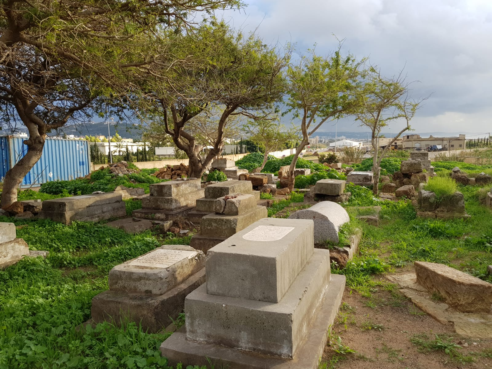
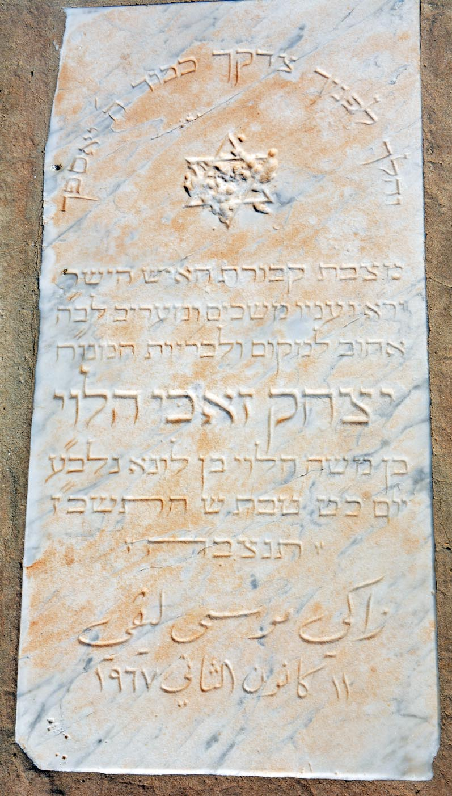
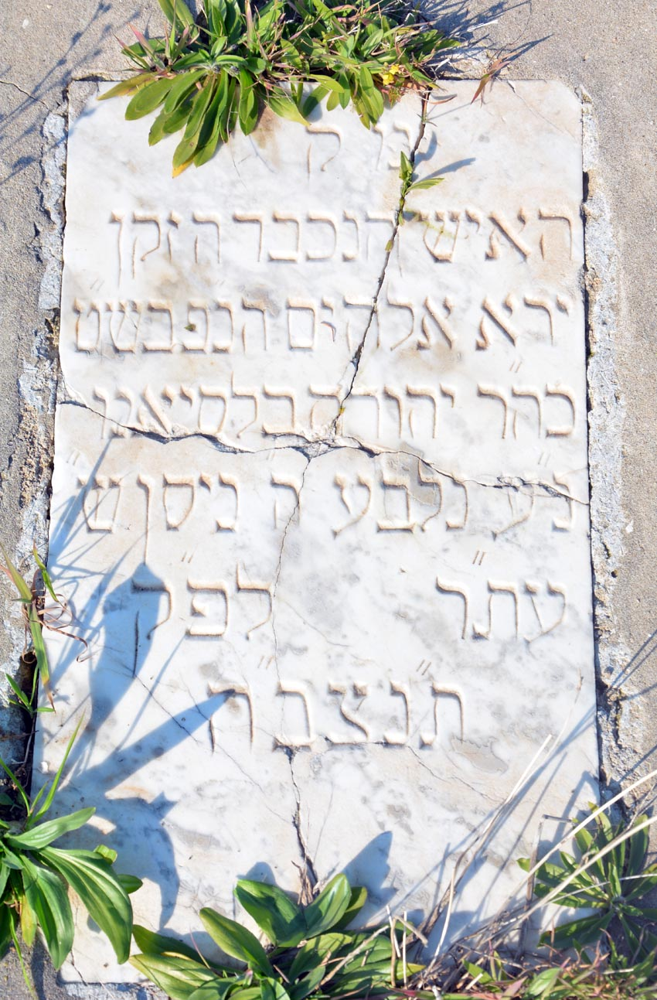
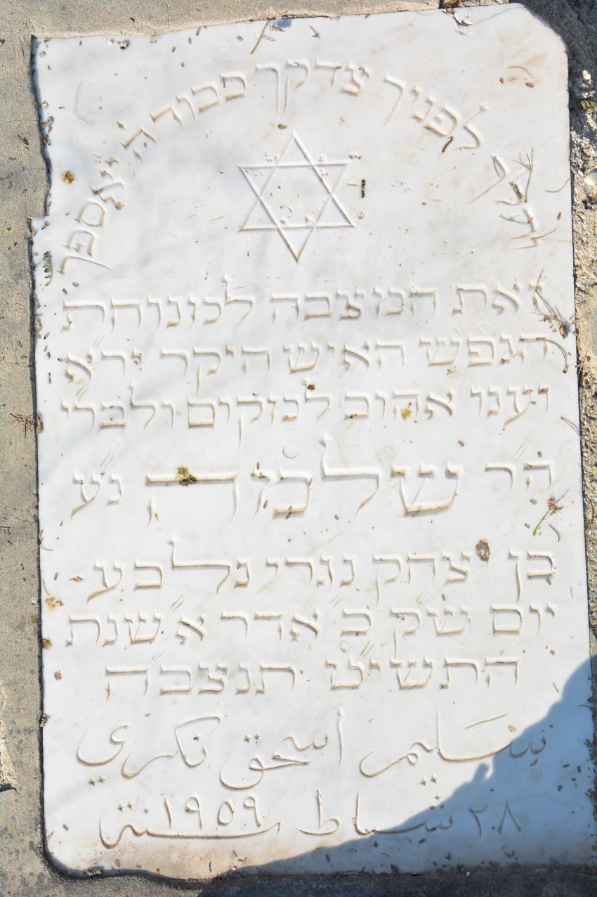
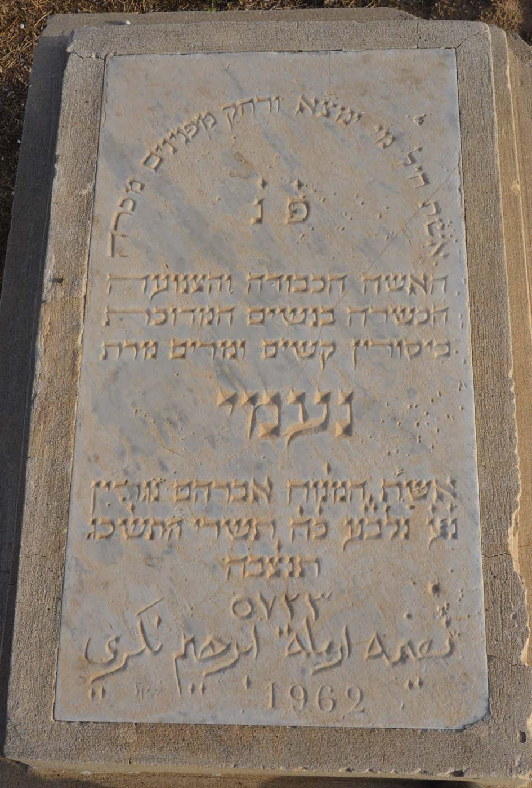
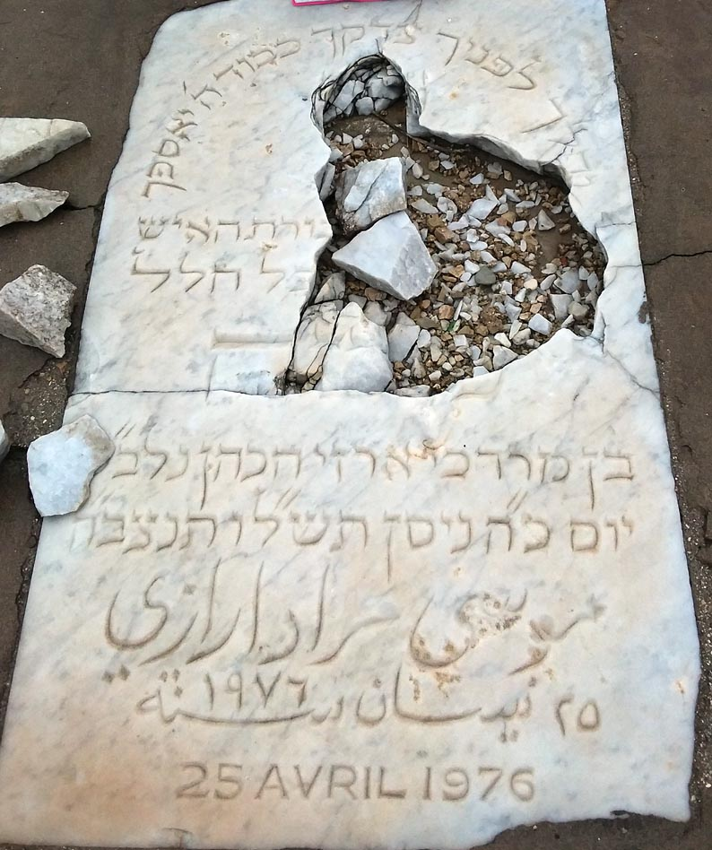

**Press Kit**
**Contato:**  
nabisaydoun@gmail.com  
27 Outubro 2024  

### Nabi Saydoun: Um Novo Site para Preservar o Legado da Comunidade Judaica de Sidon

Em um iniciativa para preservar e honrar a memória da comunidade judaica libanesa de Sidon, um novo site, [nabisaydoun.org](http://nabisaydoun.org), foi lançado. Esta plataforma serve como um arquivo digital dedicado ao cemitério comunitário, que tem sido negligenciado desde a saída da comunidade no último quarto do século XX, e a outros locais históricos judaicos na cidade libanesa de Sidon (conhecida em árabe como Saida).

O site apresenta um mapa interativo do cemitério, exibindo fotografias detalhadas da maioria das lápides. Esta ferramenta permite que os visitantes explorem os locais de descanso dos falecidos, garantindo que seus nomes e legados não sejam esquecidos. Além disso, uma tabela pesquisável inclui nomes, datas e outros detalhes vitais das pessoas enterradas ali. A tabela e a documentação dos falecidos não estão completas; este é um processo contínuo de tradução e identificação. O site está disponível em inglês, português e francês; uma versão em árabe também está em desenvolvimento.

Ao interagir com o site, os visitantes podem ajudar a reviver e manter a memória desta comunidade, garantindo que suas contribuições para Sidon e o amplo patrimônio judaico sejam reconhecidas e honradas. A comunidade, que traça suas raízes em Sidon a figuras como Zevulun, filho de Yaakov e Lea na Torá, agora está espalhada por todo o mundo, com sinagogas de Sidon em Nova York, São Paulo e Rio de Janeiro.

O estado do cemitério reflete não apenas a negligência de sua memória, mas também a necessidade urgente de reconectar-se com o patrimônio dos judeus do Oriente Médio e do Norte da África. Encorajamos todos que visitarem o site a compartilhar suas histórias, fotografias e qualquer informação histórica que possa enriquecer ainda mais essa memória coletiva.

Para mais informações, visite [nabisaydoun.org](http://nabisaydoun.org).

  

